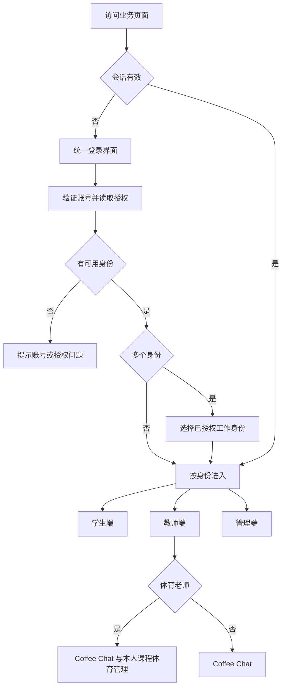
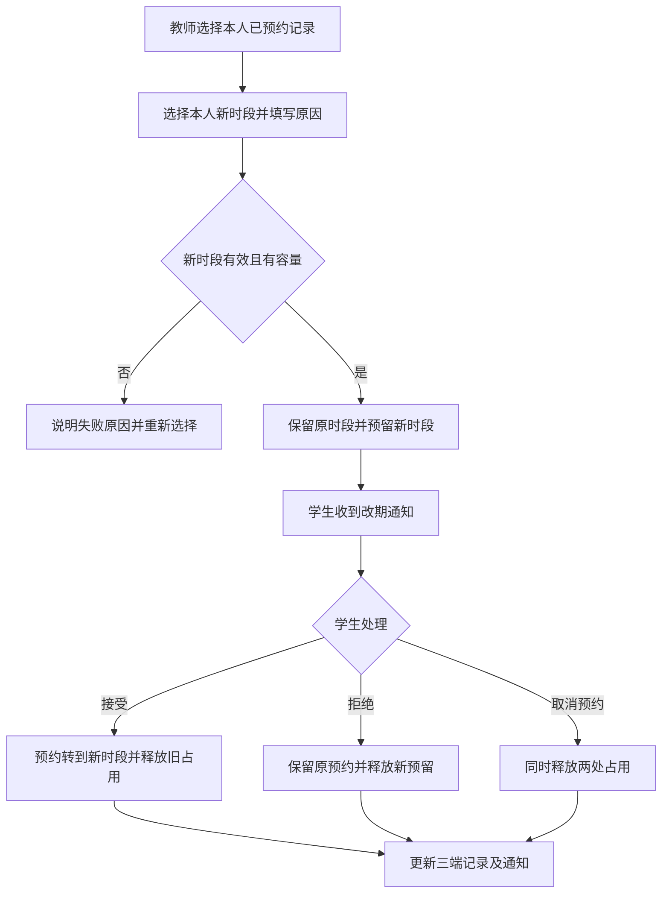
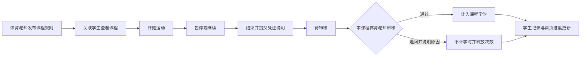

# BNBU 伴学三端业务流程

日期：2026-10-09。用途：根据现有 V2 界面的入口、表单、详情抽屉及操作确定业务流程，作为后续页面与共享业务实现的依据。

本次确定三端共用一个登录界面。教师管理本人的 Coffee Chat 时段与预约；体育老师另外管理运动课程和审核学生运动记录，普通教师没有体育管理板块。现有学生端和管理端继续使用同一套业务数据。

**阅读约定：**“现有”表示当前页面或本地操作已存在；“新增设计”表示后续需要实施的流程，不代表代码已完成；“待确认”表示尚不能据此实施的业务选择。现有实现仍为固定学生身份和管理身份切换，教师端、统一登录及真实账号认证尚未实现。

## 一 页面入口与业务归属

### 学生端现有页面

| 入口 | 页面与当前操作 | 业务结果 |
| --- | --- | --- |
| 首页 `/v2` | 查看活动、公告、运动进度及常用入口 | 进入对应模块，进度取共享记录 |
| 活动 `/v2/activities` | 搜索、筛选、打开活动详情、查看地点、访问官方报名链接 | 记录链接访问，实际报名在外部完成 |
| 公告 `/v2/announcements` | 查看分类、置顶与公告详情 | 获取校园信息 |
| 社区 `/v2/community` | 发帖、评论、点赞、收藏、举报 | 内容进入审核，审核后公开展示 |
| 找搭子 `/v2/partners` | 浏览学习、娱乐、拼车队伍，发起或申请加入 | 产生队伍与入队申请 |
| 我的组队 `/v2/partners/teams` | 查看申请、队伍、审批成员、结束队伍 | 更新成员、申请与可聊天状态 |
| 消息 `/v2/messages` | 查看会话、发送消息、查看通知、标记已读 | 仅更新本人消息与通知状态 |
| 校园服务 `/v2/campus` | 教学支持、学术讨论、校园组织、Coffee Chat、校友故事 | 通过卡片进入抽屉或相关页面 |
| 校园运动 `/v2/sports` | 课程规则、计时、凭证说明、提交、记录详情 | 产生待审运动记录及进度 |
| 校园 AI `/v2/ai` | 提问、查看来源、反馈回答 | 知识匹配与反馈处理 |
| 我的 `/v2/me` | 我的活动、组队、收藏、认证、关系展示 | 汇总本人记录；预约位于我的活动 |
| 设置 `/v2/settings` | 隐私与提醒偏好 | 保存个人偏好；真实通知渠道待接入 |

教学支持中的课堂签到目前是说明性入口，不据此扩展教学签到、成绩、作业或学校课表管理。校园关系展示不产生官方入会或报名结果。

### 管理端现有页面

| 页面 | 路由后缀 `/v2/admin` | 负责身份 | 处理对象 |
| --- | --- | --- | --- |
| 运营总览 | 空 | 按角色展示 | 待办、统计及业务入口 |
| 邮件与活动 | `/events` | 运营、超级管理员 | 邮件导入、草稿、发布、下架、恢复 |
| 公告管理 | `/announcements` | 运营、超级管理员 | 公告编辑与展示 |
| 通知投递 | `/notices` | 运营、超级管理员 | 接收人、正文、投递与已读统计 |
| 社团入驻与目录 | `/organizations` | 审核员负责审批；运营负责目录 | 申请、审核结果、目录资料、可见性 |
| Coffee Chat | `/coffee` | 运营、超级管理员 | 老师资料、时段、预约、改期与取消 |
| 校园 AI | `/knowledge` | 运营、超级管理员 | 知识、发布状态及反馈 |
| 认证审核 | `/verifications` | 审核员、超级管理员 | 认证申请、驳回、撤销 |
| 内容审核 | `/moderation` | 审核员、超级管理员 | 帖子和评论 |
| 队伍与举报 | `/teams` | 审核员、超级管理员 | 举报、队伍下架、结束、成员处置 |
| 用户与权限 | `/accounts` | 超级管理员 | 管理账号、禁言、封禁与恢复 |
| 统计与审计 | `/analytics` | 管理角色 | 共享数据统计、操作记录 |

地图地点沿用邮件活动编辑中的地点核对，学生详情显示楼栋地图；不另设地图地点后台。

### 教师端新增页面设计

沿用现有管理工作台的侧栏、列表、筛选、详情抽屉和编辑弹窗，将操作范围收缩到当前教师。以下路由是规划路径。

| 页面 | 建议路径 | 普通教师 | 体育老师 | 页面内容与主要操作 |
| --- | --- | --- | --- | --- |
| 教师工作台 | `/v2/teacher` | 有 | 有 | 今日预约、待处理改期；体育老师另有待审运动记录和课程入口 |
| Coffee Chat | `/v2/teacher/coffee` | 有 | 有 | 我的公开资料、时段、预约三个页签；新增时段、查看预约、提出改期、取消 |
| 体育管理 | `/v2/teacher/sports` | 无 | 有 | 我的课程、待审核记录、课程学时；只读取本人负责范围 |
| 通知 | `/v2/teacher/notices` | 有 | 有 | 本人的预约变化、业务处理通知与已读状态 |
| 我的 | `/v2/teacher/me` | 有 | 有 | 教师身份、授权角色、账号与退出入口 |

普通教师的侧栏、首页卡片、搜索结果均不出现体育管理。体育老师未分配课程时显示“暂无负责课程”，不能因此浏览其他老师课程。导航隐藏之外，直接访问地址、读取数据和提交操作均校验体育身份与课程归属。

## 二 统一登录与身份分流

### 登录界面与进入过程

新增一个公共登录入口，建议 `/login`。页面使用伴学品牌与同一套表单样式，三端均由此进入。学校 SSO 或账号密码的真实认证方式待确定，不能把现有演示切换当成真实验证。

1. 用户访问任意受保护页面；未登录时进入统一登录页，记住站内目标地址。
2. 用户完成账号验证；错误时停留登录页并给出可重试提示。
3. 系统读取账号状态、已授权身份、教师类别和课程归属。页面上的身份选择不能授予权限。
4. 一个可用身份直接进入对应首页；多个身份在同一登录流程内显示“选择工作身份”，仅列出账号已获授权的身份。
5. 学生进入 `/v2`；教师进入 `/v2/teacher`；管理人员进入 `/v2/admin`。审核员和运营仍属于管理端内部角色。
6. 如果原目标属于当前身份权限，返回原目标；否则进入该身份首页并解释无访问权限。
7. 教师进入后再判断是否体育老师，生成对应导航。体育老师无需再次登录。
8. 退出后回到同一登录页，清除会话及当前用户页面缓存；业务历史仍保存。

### 登录与会话异常设计

| 情况 | 用户看到的结果 | 业务要求 |
| --- | --- | --- |
| 凭证错误或认证服务不可用 | 错误说明与重新登录入口 | 不建立业务会话 |
| 无角色或身份待绑定 | 联系管理员完善身份 | 不默认授予学生、教师或管理权限 |
| 登录过期 | 返回登录并提示重新验证 | 未成功保存的操作不显示成功，不自动重复提交 |
| 管理账号停用 | 管理入口不可用 | 其他合法身份是否继续可用由账号授权判断 |
| 用户禁言 | 受限原因可见 | 限制发帖、评论、聊天，其他动作按业务规则 |
| 用户封禁 | 受限原因可见 | 沿用全部业务写入禁止；不擅自改成全部读取禁止 |
| 体育身份或课程授权撤销 | 刷新导航并拒绝下一次读写 | 已打开详情也不能继续审核 |
| 切换工作身份 | 重新读取该身份首页与待办 | 当前打开对象必须重新检查权限 |

教师类别的来源、角色发放和学校身份绑定方式见待确认事项。身份认证徽章通过不自动产生教师、体育老师或管理员权限。

## 三 学生端详细流程

### 活动浏览与官方报名

入口：首页活动卡或活动导航 → 搜索关键词、时间与类别 → 活动详情。

1. 学生查看活动标题、介绍、起止时间、地点、来源及报名链接。
2. 在详情查看地图；能匹配真实模型楼栋则定位到楼栋，模糊地点显示待确认。
3. 点击官方报名链接，保存一次访问记录并跳转邮件中的链接。
4. “我的 → 我的活动”显示“已访问官方报名页面”；实际报名成功与否由学校外部系统告知。
5. 活动下架后从列表、搜索和详情公开入口移除；恢复需要运营重新核对与填写原因。

无有效链接时不给可用报名按钮。平台统计点击次数和独立访问人数，不生成报名成功、站内票券、候补或签到记录。

### Coffee Chat 预约与改期

入口：校园服务 → Coffee Chat 抽屉 → 搜索老师、学院或研究方向 → 老师详情 → 时段。

1. 学生核对老师、地点和时间，选择可预约时段并点击“确认预约”。
2. 系统检查老师可见、时段开放且未开始、容量足够、本人无重复或重叠预约。
3. 保存已预约记录，扣占容量，显示成功，在“我的 → 我的活动”展示。新增教师端同步显示同一预约并收到通知。
4. 学生可从时段或我的预约取消，取消后释放占用；教师端与管理端更新为已取消。
5. 教师或运营提出改期时，学生收到通知；预约详情同时显示原时段、新时段、原因与接受/拒绝按钮。
6. 接受：重新校验新时段，将预约转到新时段并释放原占用；拒绝：保留原预约并释放新时段预留。
7. 改期待确认期间学生取消预约，应同时释放原时段和拟改时段占用。

当前预约为选择时段后直接确认，未设置教师逐笔审批。教师管理预约不自动增加“等待老师同意”步骤。

### 校园运动

入口：首页运动卡片或校园运动 → 课程规则与进度 → 运动打卡/运动记录。

1. 查看课程、学期、任课老师、目标学时、已通过学时、最低时长、单次最多计入、每天和每周次数上限。
2. 新增多课程设计：先选已关联且已发布课程；无课程或规则未发布时展示原因，不能使用默认示例规则代替。
3. 选择项目后开始；系统检查本人课程资格、规则、次数上限及是否已有未完成运动。
4. 运动中可暂停、继续、结束；暂停不计时，刷新恢复当前运动和草稿。
5. 结束后进入摘要，显示实际时长与本次可申请时长；上传 JPG/PNG/WebP 凭证，单张不超过 1 MB，并填写不超过 500 字说明。
6. 时长不足或缺少凭证、说明时不能提交。达到要求后提交为待审核，记录进入本人记录页；新增流程投递到该课程体育老师的审核队列。
7. 待审时不计学时，但与通过记录一起占用次数；审核通过才增加学时，退回不计学时并释放次数占用。
8. 学生查看审核结果、原因和通知。现有退回流程是重新记录符合要求的运动；补材料后重新审核属于待确认扩展。

现有示例为 16/20 小时，最低 30 分钟、最多计入 90 分钟、每天 1 次、每周 3 次。自然日与周一开始的自然周按上海时区计算；这些数值只用于现有演示，不自动成为所有课程规则。

新增流程将学生页面的“模拟审核结果”替换为只读审核状态，真实审批入口归属有课程权限的体育老师。模拟增加时长只用于明确隔离的演示，不能影响正式学时。

### 社区内容与举报

1. 社区 → 发布帖子 → 填标题、分区、正文 → 提交待审；标题最多 80 字、正文最多 1000 字。
2. 作者看到待审提示；审核员通过后公开展示，隐藏后从公开列表、搜索、收藏及详情移除。
3. 在详情提交评论，最多 300 字；评论进入待审，通过后展示。
4. 学生可对可见内容点赞或收藏；举报时选择当前对象并填写原因。
5. 同一学生对同一目标的待处理举报不重复创建。审核员处理后通知举报人；执行内容处置时同时通知作者。
6. 禁言或封禁用户提交时展示限制原因，保存失败时不关闭为成功状态。

### 找搭子与组队

1. 找搭子 → 按学习、娱乐、拼车筛选 → 打开队伍详情 → 申请加入。
2. 系统检查队伍开放、可见、有名额、本人未加入且没有重复申请，生成待处理申请。
3. 队长在我的组队打开详情，查看待处理人员，选择同意或婉拒。
4. 同意时再次检查容量；成功才加入成员，申请与成员列表同步。满员或队伍状态变化时阻止操作。
5. 成员通过消息页面交流；队长可结束组队。
6. 队伍结束、下架或成员被移除后，限制相关人员继续发送队伍消息；申请历史保留并标注下架状态。
7. 发起队伍时填写类型对应字段、时间、地点与容量；创建不生成虚构成员申请或自动回复。

### 社团入驻与关注

校园服务 → 校园组织 → 搜索目录、关注/取消关注，按官方联系方式申请入会。关注状态进入本人数据，不能作为社团会员资格。

学生代表点击“代表社团申请入驻”，填写名称、介绍、类别、官方联系方式 → 提交待审 → 审核员通过或填写原因驳回 → 学生查看我的入驻申请。通过后才进入目录；重复待审或已通过名称不能再次申请。运营下架目录时通知代表，已审核通过资格与目录是否展示分别保存。

### 认证与个人记录

我的 → 身份认证 → 选择学生、社团或官方机构 → 填学院/组织和说明 → 提交待审 → 审核结果与原因展示。待审不重复提交；撤销认证需要原因与通知。教师登录授权不通过这个学生认证弹窗获得。

我的活动汇总外部链接访问及 Coffee Chat；我的组队汇总本人队伍；收藏过滤已下架内容。个人关系展示沿用已有数据含义，不推断学校正式履历。

### 消息与校园 AI

消息页分会话和校园通知；通知点击后标记本人已读并进入业务对象。目标已下架或权限已改变时显示不可访问原因。管理员没有私人聊天查看入口。

校园 AI → 输入问题 → 匹配已发布知识并显示来源；未命中时提供明确的本地导航回答 → 学生反馈回答问题 → 运营处理 → 结果通知学生。待处理的同一反馈不重复创建。当前不将知识关键词匹配描述为实时大模型能力。

## 四 教师端详细流程

### 教师进入与工作台

教师从统一登录进入，系统绑定账号与教师资料 ID。工作台按本人数据显示今日预约、近期时段和改期待确认预约。体育老师增加本人课程及待审核记录入口；普通教师页面不保留空白体育板块。

教师类别属于已授权身份，不能在个人资料里自行勾选成为体育老师。教师和管理人员可能同时拥有两种身份，但必须在明确的工作身份下操作并记录操作者。

### 我的 Coffee Chat 资料与时段

1. 进入 Coffee Chat → 我的资料，查看公开姓名、学院、研究方向、话题、介绍与地点。身份字段的维护归属待确定，资料编辑不能改变体育身份。
2. 打开我的时段，新建开始/结束时间、容量与开放状态；教师字段固定为本人。
3. 保存前检查起止顺序、未来可预约时间、正整数容量及本人时段不重叠。
4. 保存成功后学生目录读取相同时段。满额显示不可预约，不删除原记录。
5. 无预约时可调整或关闭；有有效预约或改期预留时禁止直接改时间、换老师、关闭。
6. 已有预约需先逐笔取消或改期；容量不得小于已有占用，含改期预留。

现有学生 UI 写“每次交流 30 分钟”和“一对一”，管理时段支持时间范围与容量。后续需确定是否统一固定 30 分钟和容量 1；确定前应在学生展示中读取实际时段，避免文字与实际容量冲突。

### 我的预约与取消

教师进入预约列表，按日期和状态查看本人预约 → 打开详情核对学生、时段、地点与状态。显示业务所需学生信息，不能从预约入口访问其私人聊天或无关课程记录。

学生预约成功即为已预约，教师可查看、提出改期或填写原因取消。教师取消成功后通知学生并释放容量；已取消记录保留历史。运营仍可按现有权限协助处理，双方修改同一记录，每次操作重新检查最新状态。

预约时间结束不自动证明交流完成。到场确认、完成、爽约与评价尚未定义，不生成这些事实或统计。

### 教师发起改期

只能对已预约记录提出一个待确认改期，且新时段属于同一老师。学生接受时再次校验新时段；若已失效，提示拒绝并联系老师或运营。自动超时取消改期及提醒频率尚待确定，不能默认静默释放预约。

### 体育老师管理课程

本节是已确认业务范围内的新增流程设计，具体课程生命周期与授权分配仍按待确认事项落实。

1. 体育老师进入体育管理 → 我的课程，读取本人负责课程、学期、学生人数、目标学时和发布状态。
2. 新建或编辑课程草稿，填写名称、学期、目标时长、单次最低时长、最多计入时长、每日/每周次数、允许项目和适用学生范围。
3. 保存校验：最低时长为正且不超过最多计入时长，次数为正整数，学期及课程关联完整。
4. 发布前展示规则摘要；只有已配置学生归属的已发布课程才进入学生课程卡片。
5. 新增设计建议采用“草稿 → 已发布 → 已归档”；草稿不接收运动提交，归档保留查询。归档时未完成运动和待审记录如何处理需先确认。
6. 学生关系使用明确的课程成员记录，不能凭学校、学院或当前登录身份自动扩大范围。
7. 规则修改建议生成版本并明确生效时间；已提交运动保留提交时规则。是否允许学期中改规则及追溯处理需先确认。

课程卡片及详情均显示最低时长、最多计入、每日/每周上限。未发布规则显示“规则未发布”，不能填入当前演示课程的默认值。

### 体育老师审核运动记录

1. 体育管理 → 待审核，按本人课程、日期、学生和状态筛选。
2. 打开详情，查看学生、课程、项目、开始时间、有效时长、可计入时长、凭证与说明、适用规则版本。
3. 再次核对体育身份、课程归属、记录属于该课程且仍为待审。
4. 通过：记录审核人和时间，按规则计入本次时长，刷新学生课程及首页进度，并通知学生。
5. 退回：填写明确原因，保存退回结果，不增加学时，并更新次数占用；学生收到通知并在详情查看原因。
6. 重复点击、教师与管理员并发处理、页面滞后均只能产生一次有效审核；第二次操作提示已处理。
7. 保存失败不改变审核状态或学时，不发送成功通知；保留输入供重试。

普通教师和学生不能审核。体育老师甲不能审核体育老师乙课程；超级管理员是否具备代审权、审核通过后能否撤销，均尚未授权。已通过记录不提供随意编辑学时入口。

## 五 管理端详细流程

### 每日工作台

管理人员登录 → 读取角色 → 展示有权限的待办与统计 → 点击对应模块处理 → 返回后更新待办数量。超级管理员维护账号权限，审核员处理认证内容举报与入驻，运营处理活动目录预约通知和知识。

新增教师业务的管理总览可展示授权范围内的汇总，但查看全校体育明细、代审或改学时权限需另外确认，不能因“超级管理员”名称自动扩展。

### 学校邮件转为活动

1. 邮件与活动 → 粘贴主题正文或导入 2 MB 内 `.eml`/`.txt`。
2. 提取候选标题、日期、地点和链接；多日期、多链接交给运营核对；同一主题正文拒绝重复导入。
3. 一封邮件对应一个草稿，运营核对标题、正文、类别、起止时间、地点与外部链接。
4. 发布时校验必填项、时间有效、链接来自原邮件；成功后学生列表与详情可见。
5. 地址改变时清除旧手动楼栋覆盖，重新匹配；不确定时保持待确认。
6. 下架须原因；恢复时重新核对并填原因，产生审计并通知曾访问链接的用户。
7. 查看访问量与独立访问人数，保留示例数据标识。自动学校收件需另行接入授权。

### 认证与内容审核

认证列表 → 待审详情 → 核对类型、组织和说明 → 通过或填原因驳回 → 更新本人认证展示与通知。已通过认证撤销时填写原因并记录审计。

内容列表 → 待审帖子/评论 → 查看上下文 → 展示或隐藏 → 更新学生公开页面、详情、搜索与收藏。恢复时仍校验当前对象状态并记录原因。不能因内容下架而抹去其历史处置记录。

### 举报和队伍处置

待处理举报 → 查看对象与举报原因 → 判定成立或驳回 → 成立执行对应下架，驳回保留内容 → 通知举报人与受处置作者 → 审计留存。

队伍异常可下架、恢复、结束或移除非队长成员；填写原因并通知受影响人员。审批入队仍遵守容量，管理员不能通过另一页面绕过同一约束。

### 社团目录

审核员查看待审申请，核对资料与官方联系方式，通过后创建目录或填原因驳回。运营维护已通过目录的名称、介绍、类别、负责人展示及官方联系方式；下架须原因并通知代表。重新展示不虚构学校官方资质审批。

### Coffee Chat 协调

运营维护教师目录，查看共享时段与预约，按现有流程协助取消和改期。新增教师自己维护时段后，两端继续编辑同一时段和预约；教师范围为本人，运营范围遵循管理权限。仍有有效预约时停用老师应先处理预约，不得让学生预约消失。

### 公告和通知

运营编辑公告标题、正文、分类及置顶信息，学生公告页面同步展示。定向通知另行选择接收人、标题和正文，保存投递批次及每位用户通知；只统计成功生成通知中的已读比例。

业务自动通知需关联对象：预约建立、取消、改期、审核结果、下架处置、入驻结果及反馈处理。教师通知属于新增接收范围。当前本地通知不等于短信、邮件或推送已送达。

### 校园 AI 维护

运营填写知识标题、正文、关键词与来源 → 保存并发布 → 学生提问可命中；取消发布后新回答不再使用。反馈队列保留原问题和回答快照，运营填写处理结果后通知提交人。

### 用户权限与审计

超级管理员维护启用状态与管理角色；唯一超级管理员不可停用或降级。禁言、封禁与恢复填写原因，即时约束用户写入并通知当事人。

教师账号与教师资料的绑定、体育身份及课程负责人的配置属于新增账号管理需求，授权来源仍待确定。操作记录应保留账号 ID、工作身份、动作、对象、时间、原因和结果；展示名称不能代替身份标识。

## 六 三端权限与共享数据

### 权限矩阵

“待定”表示尚未授予权限；教师列为本次确认范围，具体页面尚未实施。

| 操作 | 学生 | 普通教师 | 体育老师 | 运营 | 审核员 | 超级管理员 |
| --- | --- | --- | --- | --- | --- | --- |
| 浏览活动、访问外部报名 | 现有 | 教师端公共入口待定 | 同左 | 管理活动 | 无活动维护权 | 管理活动 |
| Coffee Chat 预约/取消本人预约 | 本人 | 管理本人被预约记录 | 同左 | 协调管理 | 无 | 协调管理 |
| 维护老师时段、提出改期 | 无 | 本人 | 本人 | 现有管理范围 | 无 | 现有管理范围 |
| 接受/拒绝预约改期 | 本人 | 无代确认权 | 无代确认权 | 无代确认权 | 无 | 无代确认权 |
| 体育板块 | 学生运动页 | 无 | 有 | 待定 | 无 | 待定 |
| 管理运动课程与规则 | 无 | 无 | 本人负责课程 | 待定 | 无 | 待定 |
| 提交运动 | 本人所属课程 | 无学生身份时不可 | 无学生身份时不可 | 无 | 无 | 无 |
| 审核运动 | 无 | 无 | 本人负责课程 | 待定 | 无 | 代审待定 |
| 审核认证、内容、举报与入驻 | 提交本人申请/内容 | 无 | 无 | 无 | 有 | 有 |
| 维护通知、知识与已入驻目录 | 无 | 业务通知自动产生 | 同左 | 有 | 无 | 有 |
| 账号授权、禁言和封禁 | 无 | 无 | 无 | 无 | 无 | 现有管理权 |
| 查看私人聊天 | 本人会话 | 不因教师身份获得访问权 | 同左 | 无 | 无 | 无 |

### 共享对象与联动

| 对象 | 权威业务记录 | 变更后的读取方 |
| --- | --- | --- |
| 账号和授权 | 新增账号、角色、教师类别、绑定关系 | 登录页与三端权限判断 |
| 老师与时段 | 现有共享目录，新增账号绑定 | 学生目录、教师时段、运营 Coffee Chat |
| 预约 | 同一预约 ID、学生 ID、时段 ID、状态与拟改时段 | 我的活动、教师预约、运营预约 |
| 课程 | 新增课程 ID、教师关系、成员、规则版本、发布状态 | 学生课程、体育老师课程与审核 |
| 运动记录 | 新增归属用户与课程、规则版本、审核人时间；保留凭证说明 | 学生记录、老师待审、课程进度 |
| 学时 | 由通过记录汇总，历史初始学时注明来源 | 学生首页、课程进度、教师汇总 |
| 活动和内容 | 现有目录、发布与处置状态 | 管理页、学生列表、搜索及详情 |
| 通知与审计 | 按用户 ID 隔离通知，动作关联业务对象 | 三端本人通知和授权管理审计 |

现有 `sports` 为单学生演示，不能只给老师加列表便宣称多人业务完成。后续需要按用户 ID、课程 ID 和教师归属建立共享记录；姓名仅作展示。持久化迁移必须保留旧数据、空数组和示例标记。

### 通用失败与一致性

每次写入依次检查登录身份、操作权限、对象归属、当前状态和业务规则，再保存数据。界面显示成功以保存成功为前提。重复点击和并发审核不能重复占用名额或累计学时。

本地持久化失败应显示错误；读取失败停止业务操作并提供重试，不能用默认演示数据掩盖。当前 localStorage 同步只覆盖同源浏览器标签，真实多人登录、并发预约及审核依赖服务端事务和权限。

通知链接不能绕过权限。业务已成功但外部通知失败时应保存可重试投递状态，不能让用户再次提交业务来补发通知。

## 七 后续页面实施与验收清单

本次为流程设计核对，以下是后续实施验收场景，尚未执行。

| 编号 | 操作场景 | 必须观察到的结果 |
| --- | --- | --- |
| L01 | 从三端地址未登录访问 | 均到同一登录界面；合法目标可恢复 |
| L02 | 普通教师登录 | 有 Coffee Chat，无体育导航、卡片、搜索结果 |
| L03 | 普通教师直接访问体育地址或提交审核 | 读取和写入均拒绝，数据不变化 |
| L04 | 体育老师无课程/有本人课程 | 空状态明确；仅展示本人课程 |
| L05 | 多身份账号切换、退出、会话过期 | 权限重新读取，缓存不串用户 |
| C01 | 教师新建时段，学生预约 | 三端看到同一时段与预约，容量一致 |
| C02 | 重叠、过期、满员、重复预约 | 明确失败，无多余记录 |
| C03 | 教师或运营发起改期，学生接受 | 仅一笔预约，释放原占用并更新通知 |
| C04 | 拒绝改期或待确认时取消 | 分别释放新预留或两处占用 |
| C05 | 另一老师尝试修改预约 | 拒绝；本人的预约不变 |
| S01 | 体育老师发布规则、学生查看课程 | 卡片与详情规则一致，未发布无默认替代 |
| S02 | 暂停、刷新、结束、上传、提交 | 有效时长与草稿正确，记录进入负责老师队列 |
| S03 | 老师通过记录 | 学时只增加一次，首页与课程页一致 |
| S04 | 老师退回并填写原因 | 不计学时，释放次数，学生收到原因 |
| S05 | 普通教师、其他体育老师、学生审核 | 均被拒绝 |
| S06 | 两个页面重复或同时审核 | 仅一个有效结果，第二次提示已处理 |
| S07 | 上海时区跨天、跨周，达到次数限制 | 按课程规则计算，待审与通过占次数 |
| A01 | 邮件发布、下架及恢复 | 学生可见性、原因、来源与访问统计一致 |
| A02 | 社团审批、关注、下架 | 目录和通知一致，不产生会员资格 |
| A03 | 禁言封禁、举报处置 | 学生操作层即时受限，通知与审计可核对 |
| D01 | 读取或保存失败 | 无虚假成功，无默认数据覆盖 |
| D02 | 手机与桌面查看三端 | 沿用现有层级，详情和主要操作可达，无水平溢出 |

需要补充的 UI：统一登录及多身份选择；教师工作台、Coffee Chat、通知与个人页；体育老师课程与审核页面；学生课程选择及真实审核结果；管理员教师授权与课程关系配置入口（责任归属确认后实施）。

现有页面需调整的文案与操作：右上角演示切换不能充当登录；学生运动模拟审核不能留作正式审批入口；Coffee Chat 的固定时长/一对一文案应与时段规则一致；教师改期通知需能直达学生我的预约。

## 八 实施前仍需确定的业务选择

| 事项 | 需要确定的选择 | 影响 |
| --- | --- | --- |
| 真实登录方式 | 学校 SSO、学校邮箱验证或平台账号 | 登录字段、找回与账号生命周期 |
| 体育老师身份来源 | 学校同步或超级管理员维护 | 体育权限的发放和撤销；教师不能自授 |
| 课程和学生归属 | 教师建课后分配学生，或学校同步/管理员分配 | 谁能看到课程、谁能审核 |
| 多教师课程 | 单负责人还是多位任课老师 | 审核数据范围和交接 |
| 课程规则变更与归档 | 生效时间、旧记录适用版本、待审记录处理 | 学时一致性和历史可追溯 |
| 管理端体育权限 | 是否只看汇总，是否代审或纠错 | 管理端新增页面与操作权限 |
| 运动复核 | 退回后重做，或允许补材料/申诉；通过后撤销 | 新状态、通知及学时回退 |
| Coffee Chat 时长与容量 | 固定 30 分钟一对一，或按时段配置 | 学生详情与容量校验 |
| 改期与取消期限 | 是否截止、超时、提醒、到场或爽约 | 新状态与自动任务 |

以上事项保留为待确认，不影响此次已确定的“统一登录、教师管理本人 Coffee Chat、仅体育老师具有体育管理”范围。

## 九 当前界面依据

- [业务规则](../BUSINESS_RULES.md)：现行约束与本轮已确认变更。
- [V2 路由与导航](../src/v2/V2App.tsx)：学生端、管理端入口及当前演示身份切换。
- [校园服务与我的](../src/v2/services.tsx)、[学生管理组件](../src/v2/StudentManagement.tsx)：服务抽屉、入驻、认证及预约改期入口。
- [Coffee Chat](../src/v2/V2CoffeeChat.tsx)：教师搜索、时段选择与预约按钮。
- [校园运动页面](../src/v2/SportsPage.tsx)、[运动操作](../src/v2/sports.ts)：计时、凭证、规则及模拟审核。
- [管理导航](../src/v2/adminNavigation.ts)、[管理操作](../src/v2/managementOperations.ts)：管理分工、预约约束、通知与处置。
- [学生页面](../src/v2/student.tsx)：社区、队伍、消息操作。

旧 `INFORMATION_ARCHITECTURE.md` 中站内报名、票券与旧路由不作为此次 V2 业务依据。
